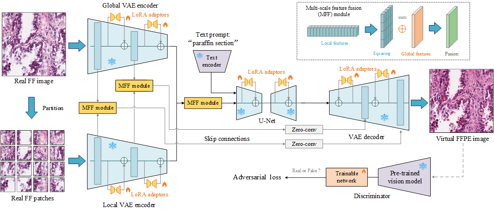

# Leveraging Pre-trained Models for FF-to-FFPE Histopathological Image Translation



[Paper](http://arxiv.org/abs/2406.18054) | [Models](https://cloud.tsinghua.edu.cn/d/2892cd01a94e49519068/) 

### Prerequisites

- Python >= 3.8
- NVIDIA GPU + CUDA CuDNN
- Torch 2.0.1 + Torchvision 0.15.2

### Getting started

- Clone this repository:

```bash
git clone git@github.com:QilaiZhang/Diffusion-FFPE.git
cd Diffusion-FFPE
pip install -r requirements.txt
```

- Install [CONCH](https://huggingface.co/MahmoodLab/CONCH) and place it in ./checkpoints
- Prepare FF and FFPE datasets following [AI-FFPE](https://github.com/DeepMIALab/AI-FFPE), and split the datasets into training, validation, and test sets.

### Training

- Train the Diffusion-FFPE model:

```bash
python train.py --train_source_folder [TRAIN_FF_FOLDER] --train_target_folder [TRAIN_FFPE_FOLDER] --valid_source_folder [VALID_FF_FOLDER] --valid_target_folder [VALID_FFPE_FOLDER]
```

- Resume training from latest checkpoints:

```bash
python train.py --train_source_folder [TRAIN_FF_FOLDER] --train_target_folder [TRAIN_FFPE_FOLDER] --valid_source_folder [VALID_FF_FOLDER] --valid_target_folder [VALID_FFPE_FOLDER] --ckpt_path [CHECKPOINTS_FOLDER] --resume
```

### Inference

- Download pre-trained [checkpoints](https://cloud.tsinghua.edu.cn/d/2892cd01a94e49519068/) and place it in ./checkpoints.
- Generate FFPE images from FF test dataset:

```bash
python inference.py --img_path [TEST_FF_FOLDER] --pretrained_path ./checkpoints/model.pkl
```

### Evaluation

- Compute statistics for FFPE test datasets:

```bash
python eval.py --data_path [TEST_FFPE_FOLDER] --ref_path [TEST_STATISTICS_PATH] --save-stats
```

- Compute FID and KID:

```bash
python eval.py --data_path [GENERATE_FFPE_FOLDER] --ref_path [TEST_STATISTICS_PATH] --fid --kid
```

### Visualization


### References

If our work is useful for your research, please consider citing:

```
@inproceedings{zhang2024leveraging,
      author={Qilai Zhang and Jiawen Li and Peiran Liao and Jiali Hu and Tian Guan and Anjia Han and Yonghong He},
      title={Leveraging Pre-trained Models for FF-to-FFPE Histopathological Image Translation}, 
      booktitle={arXiv preprint arXiv:2406.18054},
      year={2024}
}
```

### Acknowledgments

Our code is developed based on [img2img-turbo](https://github.com/GaParmar/img2img-turbo), [vision-aided-gan](https://github.com/nupurkmr9/vision-aided-gan), [CONCH](https://github.com/mahmoodlab/CONCH) and [clean-fid](https://github.com/GaParmar/clean-fid). Thanks for their awesome work.